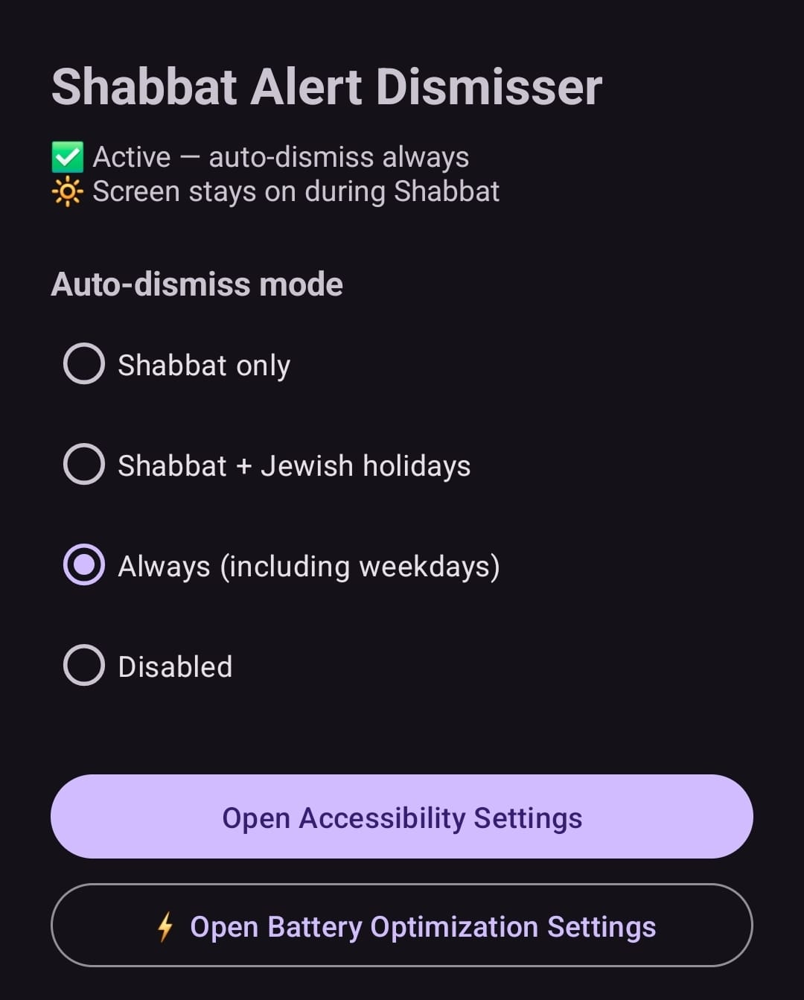
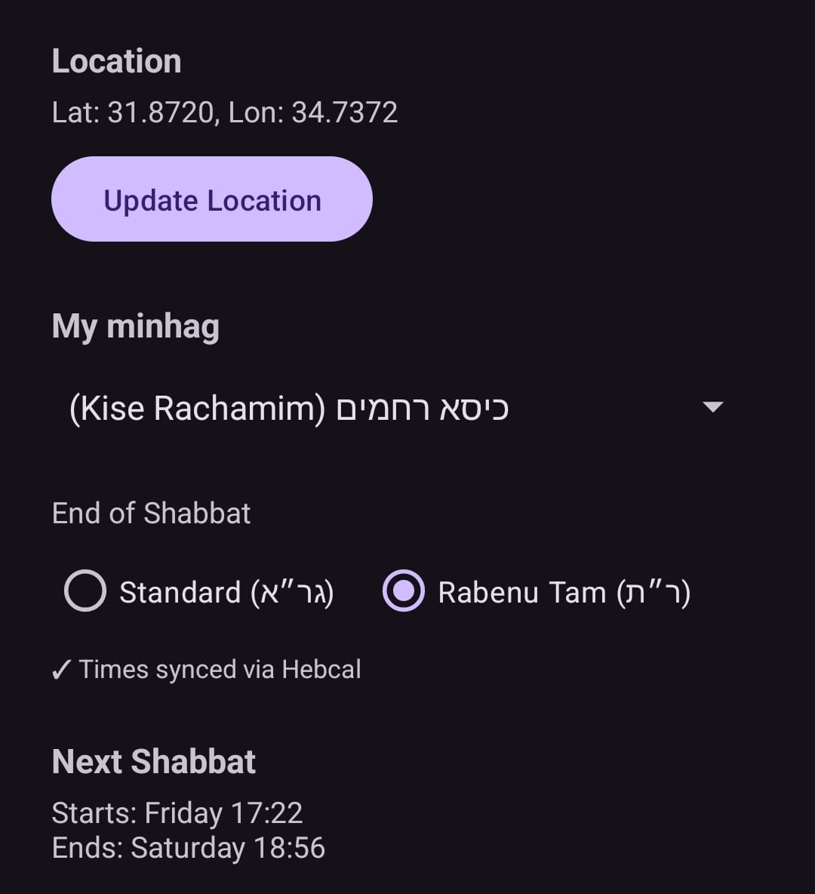
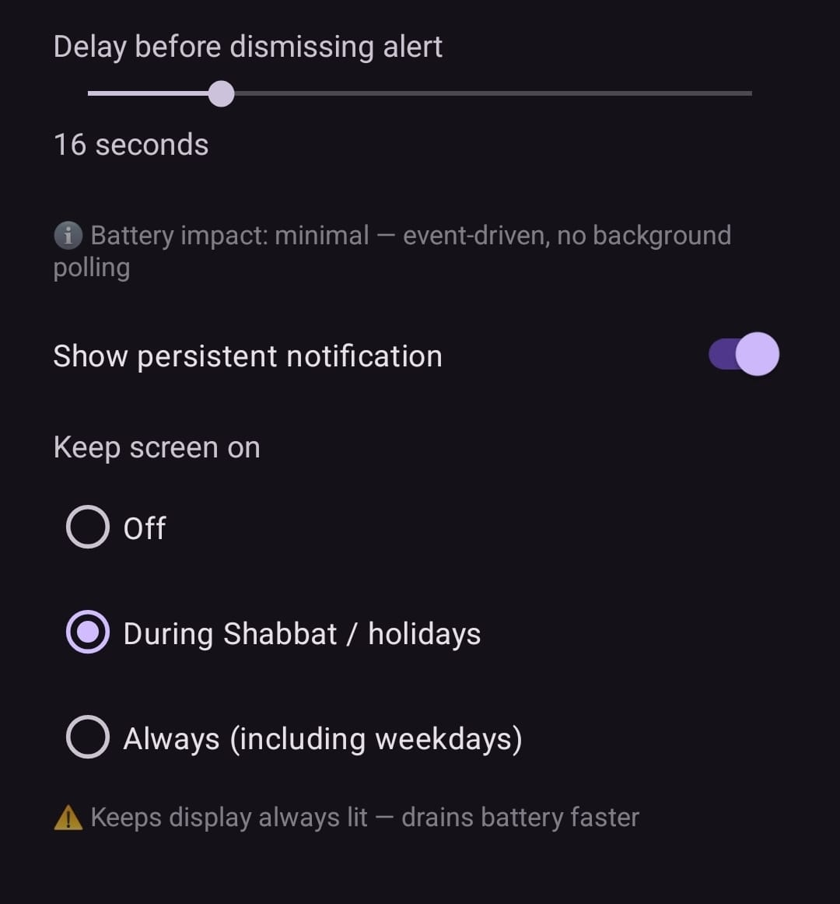
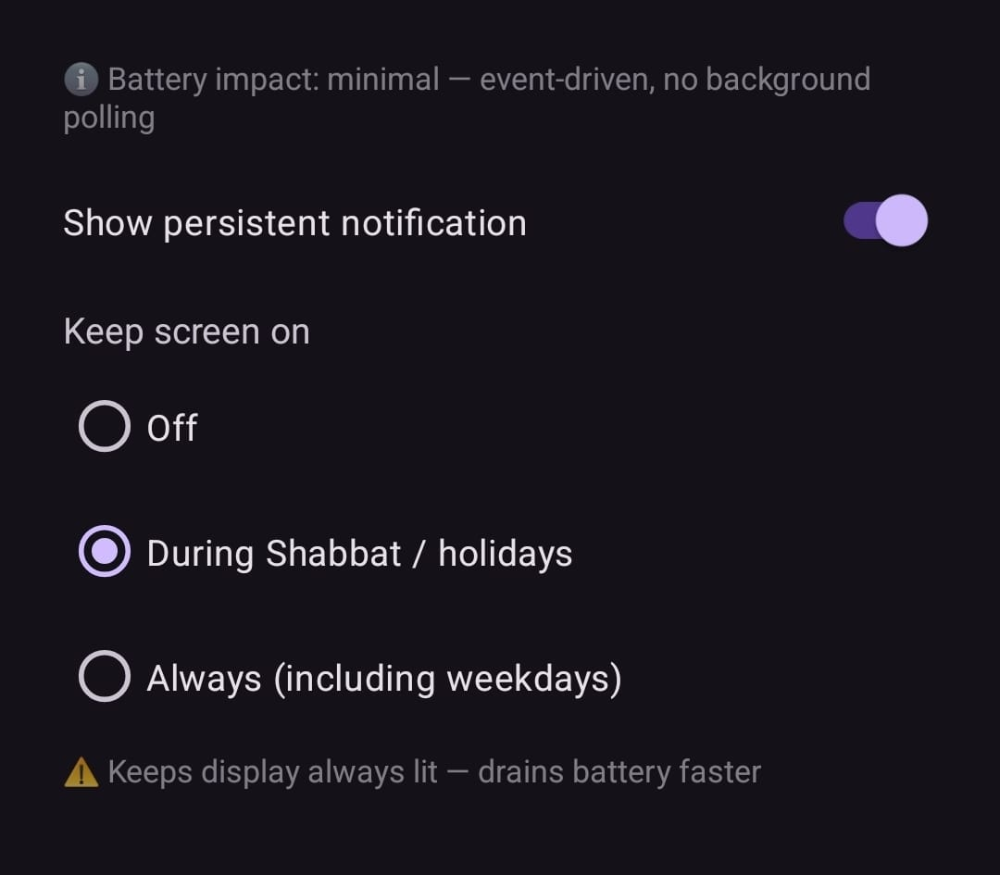
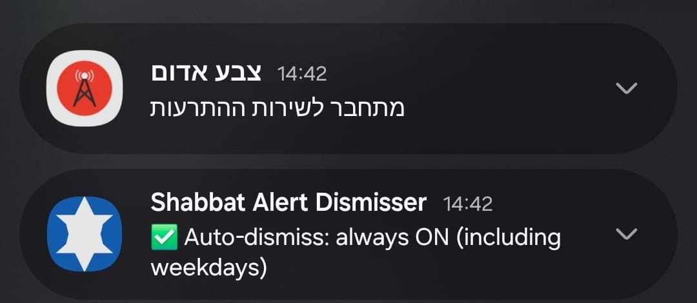

# Shabbat Alert Dismisser

An Android accessibility service that automatically dismisses cell broadcast emergency alerts (e.g. Pikud HaOref / Home Front Command) during Shabbat and Jewish holidays — so the full-screen alert doesn't block your screen while the siren still plays.

The app also provides live alert monitoring via the Pikud HaOref (Home Front Command) API, with an interactive map, alert history browser, and a threat-level state machine for your selected regions.

## How it works

The app registers as an Android Accessibility Service and listens for windows opened by cell broadcast packages. When an alert is detected during the configured time window, it waits a configurable delay (so you can hear the siren), then taps the dismiss button automatically.

Shabbat times are fetched from the **Hebcal API** based on your GPS coordinates and chosen minhag for maximum accuracy. If no network is available, the app falls back to a local **NOAA solar algorithm**.

## Features

### Alert dismissal
- Auto-dismiss during **Shabbat only**, **Shabbat + Jewish holidays**, **always**, or **disabled**
- **Minhag profiles** — choose your community calendar (Ashkenaz, Or HaChaim, Kise Rachamim, Ben Ish Chai, Jerusalem) and get accurate candle lighting / Havdalah times automatically
- **Standard (Gra) or Rabenu Tam** end-of-Shabbat, per your custom
- Configurable **delay** before dismissing (5-60 seconds) — gives you time to hear the siren
- **Persistent status notification** showing current state and upcoming Shabbat times (optional, can be disabled in-app)
- Shows upcoming Shabbat start/end times in-app, synced via Hebcal
- Offline fallback — works without internet using local sunset calculation
- Hebrew and English UI
- Supports major Android OEM cell broadcast packages (AOSP, Google, Samsung)

### Live alert monitoring
- **5-tab interface** — Status, Settings, History, Map, and Alerts
- **Live alert feed** from the Pikud HaOref (Home Front Command) API, with configurable polling frequency (off / 5-60 seconds)
- **Interactive map view** using osmdroid — shows active and historical alert locations as markers on an OpenStreetMap base layer
- **24-hour alert history cache** with tiered time grouping (1 min recent, 10 min, 30 min buckets for older alerts)
- **Region filtering** — select specific regions to monitor with searchable region picker; markers for selected regions are highlighted with bold text and yellow borders on the map
- **Within-alert region filtering** — when "show non-selected regions" is off, only your selected regions are shown even within multi-region alerts
- **Alert type filters** — filter by alert category (missiles, hostile aircraft intrusion, events) via checkboxes on the Map tab
- **Alert state machine** — persistent WARNING / ALARM / EVENT_ENDED / CLEAR threat banners for your selected regions, with reliable clearing after event_over alerts
- **Shabbat mode banner** — visual indicator on the Status tab when Shabbat auto-dismiss is active
- **Alert history browser** — cycle through tiered history groups with prev/next navigation and pause/play control
- **History grouping modes** — choose between tiered time buckets (1min/10min/30min) or a single "all alerts" view; during Shabbat, "all" mode shows only alerts since candle lighting
- **Relative time display** — alert history headers show "X min ago" / "X hr ago" alongside timestamps
- **Full localization** — complete Hebrew and English UI with no English leakage in Hebrew mode

## Screenshots

| Main screen | Minhag & times | Delay & settings |
|---|---|---|
|  |  |  |

| Screen-on options | Notification |
|---|---|
|  |  |

## Setup

1. Build and install the app
2. Open the app -> tap **Open Accessibility Settings**
3. Find **Shabbat Alert Dismisser** -> enable it -> confirm
4. Back in the app -> tap **Update Location** -> allow location permission
5. Select your **minhag** and preferred end-of-Shabbat (Gra / Rabenu Tam)
6. Verify the Shabbat times shown are correct for your area
7. Set the delay before the alert is dismissed
8. Done — the service runs silently in the background

## Battery impact

The app is designed to be lightweight:

| What it does | Battery cost |
|---|---|
| Accessibility service (idle) | Near zero — event-driven, only wakes on cell broadcast windows |
| Alert polling (Status tab active) | Configurable interval (default 30 seconds) while the Status tab is visible; stopped when navigated away |
| Notification refresh | Once per minute (negligible string update) |
| Hebcal sync | Once per week, single HTTP call |
| Location | On demand only (when you tap Update Location) |

Alert polling only runs while the app is in the foreground with the Status tab selected — it does not drain battery when the app is in the background.

> **Keep screen on** (optional): if enabled, the display stays lit during Shabbat — this *does* drain the battery significantly. The battery optimization setting below is especially recommended if you use this feature.

## Keeping the service alive (Samsung / aggressive OEMs)

Android restarts the accessibility service automatically after a normal reboot or crash. However, some OEMs (especially Samsung) aggressively kill background services to save battery, which can cause the service to stop working mid-Shabbat.

**Recommended:** add the app to the "Never sleeping apps" list:

> **Settings -> Battery -> Background usage limits -> Never sleeping apps -> add *Shabbat Alert Dismisser***

> **Note:** If you use **Force Stop** (Settings -> Apps -> Force Stop), Android will disable the accessibility service and it must be re-enabled manually. This is an Android security feature and cannot be worked around.

## Building from source

```bash
git clone https://github.com/ilanp13/ShabbatAlertDismisser.git
cd ShabbatAlertDismisser
./gradlew assembleDebug
```

Or open the project in **Android Studio (Hedgehog or newer)** and hit Run.

**Requirements:** Android SDK 34, Gradle 8.7, Kotlin 2.0, JDK 21

## Project structure

```
app/src/main/
├── java/com/ilanp13/shabbatalertdismisser/
│   ├── MainActivity.kt           # Tab-based UI with ViewPager2 and 5-tab layout
│   ├── MainPagerAdapter.kt       # Fragment adapter for the 5 tabs
│   ├── AlertDismissService.kt    # Accessibility service — detects and dismisses alerts
│   ├── StatusFragment.kt         # Status tab — active alerts, mini-map, threat banner, Shabbat banner
│   ├── SettingsFragment.kt       # Settings tab — minhag, delay, region selection, preferences
│   ├── HistoryFragment.kt        # History tab — log of dismissed alerts
│   ├── MapFragment.kt            # Map tab — full-screen interactive osmdroid map with alert markers
│   ├── AlertsFragment.kt         # Alerts tab — 24-hour alert history browser with prev/next navigation
│   ├── RedAlertService.kt        # Fetches active + historical alerts from the Pikud HaOref API
│   ├── AlertCacheService.kt      # Local alert caching with tiered time grouping
│   ├── AlertStateMachine.kt      # WARNING / ALARM / CLEAR state tracking for selected regions
│   ├── AlertTypeFilter.kt        # Alert type filtering (missiles, aircraft, events)
│   ├── OrefRegions.kt            # Hebrew region names used by the Pikud HaOref API
│   ├── OrefRegionCoords.kt       # Region GPS coordinates for map markers
│   ├── DismissRecord.kt          # Data class for dismiss history entries
│   ├── HebcalService.kt          # Fetches accurate Shabbat times from Hebcal API
│   ├── ShabbatCalculator.kt      # NOAA-based sunset / Shabbat time calculator (offline fallback)
│   ├── HolidayCalculator.kt      # Hebrew calendar converter + Yom Tov detection
│   ├── MinhagProfiles.kt         # Named community calendar profiles
│   └── BootReceiver.kt           # Refreshes Hebcal cache after device reboot
└── res/
    ├── layout/
    │   ├── activity_main.xml      # Main activity with ViewPager2 + TabLayout
    │   ├── activity_setup.xml     # First-launch setup screen
    │   ├── fragment_status.xml    # Status tab layout
    │   ├── fragment_settings.xml  # Settings tab layout
    │   ├── fragment_history.xml   # History tab layout
    │   ├── fragment_map.xml       # Map tab layout
    │   ├── fragment_alerts.xml    # Alerts tab layout
    │   ├── item_history.xml       # RecyclerView item for history entries
    │   └── item_alert.xml         # RecyclerView item for alert entries
    ├── values/strings.xml         # English
    ├── values-iw/strings.xml      # Hebrew
    └── xml/accessibility_config.xml
```

## Permissions

| Permission | Why |
|---|---|
| `INTERNET` | Fetch Shabbat times from Hebcal API; fetch live alert data from oref.org.il (Pikud HaOref) |
| `ACCESS_FINE_LOCATION` | Calculate local sunset time; center the map on your location |
| `ACCESS_COARSE_LOCATION` | Approximate location fallback |
| `POST_NOTIFICATIONS` | Show persistent status notification (Android 13+) |
| `BIND_ACCESSIBILITY_SERVICE` | Detect and dismiss alert windows |
| `RECEIVE_BOOT_COMPLETED` | Refresh Hebcal times after device reboot |

### Network calls

The app makes network requests to the following external services:

- **Hebcal API** (`hebcal.com`) — weekly sync for accurate Shabbat and holiday times
- **Pikud HaOref API** (`oref.org.il`) — live alert data and 24-hour alert history, polled at a configurable interval while the Status tab is active

## Disclaimer

This app is designed to dismiss the **screen overlay** after the alert has been displayed — it does not suppress the siren or prevent the notification from arriving. Always follow official safety instructions during an emergency.

## Privacy & Legal

- **[Privacy Policy](PRIVACY_POLICY.md)** — How we handle your data
- **[Terms of Service](TERMS_OF_SERVICE.md)** — App usage terms
